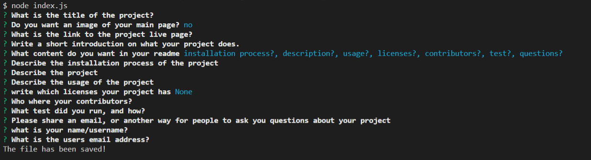

# Welcome  
  
  
  
  
  
  
  

  

  [Link to webpage](https://github.com/Nvrtis/readme-generator)
  
  intro lorem  
    
  ## Table of Content
  [-Installation](#Installation)  
  [-Description](#Description)    
  [-Usage](#Usage)  
  [-Contributors](#Contributors)  
  [-Test](#Test)  
  [-Questions](#Questions)  
  
  
  ## Installation  
  lorem

  ## Description  
  lorem 2 

  ## Usage  
  creates a readme
  
  ## Contributors  
  none
  
  ## Test  
  none
  
  ## Questions?  
  
    My Github link is [Nvrtis](https://github.com/Nvrtis)
    Any futher questions can be sent to my email here  <nvav91@gmail.com>

  
 
  
  